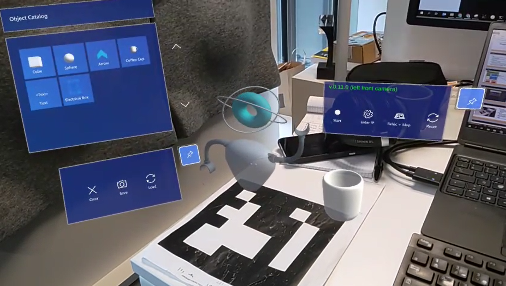
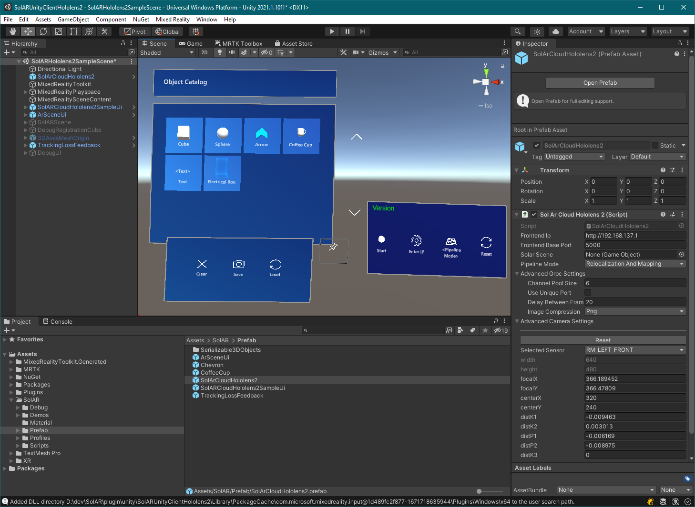

# SolARUnityClientHololens2

## Presentation

SolARUnityClientHololens2 is a Unity client to use SolAR Services containing the following elements:
* A Unity prefab that encapsulates all the logic responsible for fetching from the Hololens 2 all the data required by the SolAR relocalization and mapping service as well as the logic to call those services.
* 2 sample scenes that demontrate how to use this prefab to create AR application that rely on SolAR cloud services. One debug scene, which can display the data retrieved from the sensors, and one sample scene which offer a much cleaner and simple interface. Only the latter is meant to be shipped in project releases.

Currently, the SolAR cloud service version supported is: **v1.0.0**.

## Architecture overview

This client is based on a SolAR Unity native plugin which is responsible of getting the sensor data from the device. This plugin also provides a C# binding that enables it to be used from a Unity app scripts.

Once these data are retrieved, the SolAR services are called. The communication relies on [gRPC](https://grpc.io/).

More information about the communication layer can be found in the [doc](doc/architecture-communication.md) directory. 

## How to use the client
### Install the prebuilt sample

An app bundle for the sample app can be found in the **release** section. More details on how to install it are described [here](doc/how-to-sideload-app.md)

### Import the client in your own app
A Unity package can be found in the **release** section. With it, you will be able to easily import the client as a prefab in your application.

How to do it and how to configure the client is explained in details [here](doc/how-to-use-client.md)

The following picture illustrates how the Sample scene imported the prefab in its scene hierearchy.

