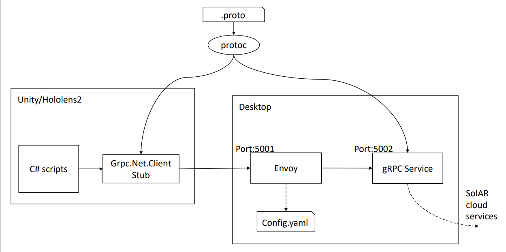
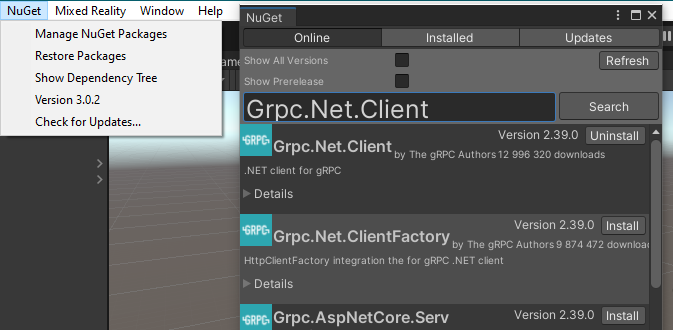
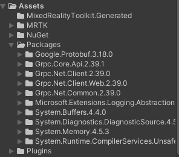

# A HoloLens 2 client for SolAR cloud services

## Overview

We want to be able to fetch images from PV (RGB) and VLC (tracking) cameras of the HoloLens 2, and send them to SolAR mapping and relocalization services in the cloud.

This document focuses on how to send the data from the HoloLens 2 to a server that will act as a proxy to call the SolAR cloud services, i.e. we will neither describe how to actually get the data from the HoloLens sensors, nor will we describe how the C++ proxy server transfers these data to the SolAR cloud services (this is described in the documentation regarding SolAR remoting feature).

The approach is using gRPC because it addresses several requirements:

- Being portable: we should reuse this feature with other devices and toolkit that allow to get camera frames. Being able to do it in C# allows us to theoretically addresses the many devices Unity supports.
- Interact with C++: SolAR remoting is currently accessible mainly in C++. GRPC allows us be called from HoloLens 2 Unity C# scripts and call the SolAR cloud services in C++ directly.

## Architecture

This is the architecture this document will help achieve: a Unity client running on a HoloLens 2 device will use portable C# scripts to call SolAR cloud services via a proxy server written in C++ that will route the requests to the SolAR/remoting infrastructure. As explained later, due to lack of support in Unity, gRPC-Web must be used, and it required the presence of an HTTP proxy called Envoy.



## Grpc.Net.Client

This version is now the officially supported library for writing gRPC client for C# ([nuget](https://www.nuget.org/packages/Grpc.Net.Client/), [github](https://github.com/grpc/grpc-dotnet)), as [gRPC.Core](https://github.com/grpc/grpc/tree/master/src/csharp) is now in maintenance mode ([source](https://grpc.io/blog/grpc-csharp-future/))
This approach is also more interesting for us, since it is a C# only approach, where the previous implementation relied on the C library, which raises cross platform support concerns. Indeed, the only official support for ARM64 is ARM64/Linux ([source](https://grpc.io/blog/grpc-on-arm64/#official-arm64-support-is-currently-linux-only)), and we need ARM64/Windows to target HoloLens 2. Using Grpc.Net.Client thus frees us from this constraint.

## gRPC-Web

Unity does not support HTTP/2 for gRPC, gRPC-Web must be used. ([source](https://docs.microsoft.com/en-us/aspnet/core/grpc/browser?view=aspnetcore-5.0#configure-gRPC-Web-with-the-net-grpc-client), [source](https://docs.microsoft.com/en-us/aspnet/core/grpc/netstandard?view=aspnetcore-5.0#httphandler-configuration))

The following snippet shows how to configure a gRPC client that uses gRPC-Web, by configuring the channel to use a `GrpcWebHandler`.

```csharp
var channel = GrpcChannel.ForAddress("https://localhost:5001", new GrpcChannelOptions
    {
        HttpHandler = new GrpcWebHandler(new HttpClientHandler())
    });

var client = new Greeter.GreeterClient(channel);
var response = await client.SayHelloAsync(new HelloRequest { Name = ".NET" });
```

If this does not work, maybe it's because the default HTTP version used is not 1.1, which can happen according to the target platform ([source](https://docs.microsoft.com/en-us/dotnet/api/system.net.http.httprequestmessage.version?view=net-5.0#remarks)).

If so, you can explicitly set this version to be 1.1 by configuring the `GrpcWebHandler` as follows:

```csharp
HttpHandler = new GrpcWebHandler(new HttpClientHandler())
{
  HttpVersion = new Version("1.1")
}
```

## Configure Unity

In order to be able to use Grpc.Net.Client package in your Unity scripts, you must have a Visual Studio C# project properly configured to declare the right references.

Unfortunately, the project cannot directly be configured in Visual Studio, because Unity won't be able to "see" these changes. An attempt to build the project from Unity will result in compilation errors whereas no errors will be visible in the properly configured Visual Studio project.

A way to solve this problem is to find a way to tell Unity how to add those references so it can configure the project properly.

When confronted to this kind of problem, a basic solution usually consists in adding the libraries directly in the `Assets/Plugins` directory of the Unity project. This make Unity aware of the libraries and they will be added to the C# Visual Studio project.

With the previous version of the gRPC library for C#, a (experimental?) Unity package was [provided](https://packages.grpc.io/archive/2021/09/d64f75d0294b0f7d383033e06e9fcbecf3d6a926-0efb7579-f45f-431f-9b1f-0795d2b7a464/index.xml). This packaged contained all the required libraries, and once imported they all were placed in the `Assets/Plugins` directory.

For Grpc.Net.Client, to our knowledge, no such package has been released. An attempt to create it manually happened to be tedious (there is some dependencies, with different versions according to the target platform) and finally not successful.

Thankfully, a solution was found: [NuGetForUnity](https://github.com/GlitchEnzo/NuGetForUnity). This project adds to Unity the ability to use the NuGet dependency manager used in Visual Studio to fetch Grpc.Net.Client and all its dependencies.



So to configure Unity to be able to use Grpc.Net.Client in the scripts, simply:

- Install NuGetForUnity by imported the latest released: [How to install](https://github.com/GlitchEnzo/NuGetForUnity#unity-20193-or-newer).
- Open the newly created NuGet menu and select Manage NuGet packages
- Install Grpc.Net.Client
- Install Grpc.Net.Client.Web (for gRPC-Web support)
- Install Google.Protobuf

These libraries should now appear in the `Assets/Packages` directory.



In the generated C# project, the gRPC client code snippet above should compile fine.

## Generate gRPC stubs and services

Visual Studio can generate stubs automatically with Grpc.Tools when a .proto file is specified in the Visual Studio project file, more details [here](https://docs.microsoft.com/en-us/aspnet/core/grpc/basics?view=aspnetcore-5.0).

As we saw, it is not possible to configure the Visual Studio project outside of Unity because the modification won't be taken into account when building the project. So it has been decided not to use Grpc.Tools, but instead generate the C# stubs manually with the protoc CLI and manually add the scripts to the project.

### Getting the gRPC CLI tools

The gRPC CLI tools can be obtained (for Windows and Linux)

- By following the instructions of [this tutorial](https://grpc.io/docs/languages/cpp/quickstart/) to build them from source (select the right version tag and don't forget to specify an install directory to easily find the executables)
- By getting one of the [Official gRPC Releases](https://packages.grpc.io/) using your dependency manager of choice
- By downloading one of [Daily Builds of `master` Branch](https://packages.grpc.io/) on the same page.

### Building gRPC from source

Reference (for prerequisite):

[Build and install gRPC and Protocol Buffers](https://grpc.io/docs/languages/cpp/quickstart/#build-and-install-grpc-and-protocol-buffers)

[gRPC C++ - Building from source](https://github.com/grpc/grpc/blob/v1.41.0/BUILDING.md)

- Windows

```bash
set MY_INSTALL_DIR=C:\Users\jmhenaff\.local\gRPC-v1.41.0
cmake -DgRPC_INSTALL=ON -DgRPC_BUILD_TESTS=OFF -DCMAKE_INSTALL_PREFIX=%MY_INSTALL_DIR% ..\..
cmake --build . --config Release
cmake --install . --config Release --prefix C:\Users\jmhenaff\.local\gRPC-v1.41.0
```

- Linux

```bash
export MY_INSTALL_DIR=~/.local/grpc-v1.41.0/
cmake -DgRPC_INSTALL=ON -DgRPC_BUILD_TESTS=OFF -DCMAKE_INSTALL_PREFIX=$MY_INSTALL_DIR ../..
make -j8
make install
```

Finally you can add `$MY_INSTALL_DIR`/bin to your PATH to be able to invoke `protoc`.

### Using the CLI tools to generate the C# stubs and C++ services

The command line used to generate the C# stubs and the C++ gRPC service are:

```bash
protoc -I ./  --csharp_out=. greet.proto --grpc_out=. --plugin=protoc-gen-grpc=grpc_csharp_plugin.exe​
protoc -I ./  --cpp_out=. greet.proto --grpc_out=. --plugin=protoc-gen-grpc=grpc_cpp_plugin
```

This will generate `Greet.cs` and `GreetGrpc.cs` that can now be added to the Unity Assets in order to be used by the other scripts.

This will also generate `greet.pb. h`, `greet.pb.cc`, `greet.grpc.pb.h` and `greet.grpc.pb.h`, that can be used in the C++ gRPC service.

## C++ service

To have a gRPC service, just implement the gRPC-generated class for this service with the desired logic.

This is an example from the [HelloWorld](https://github.com/grpc/grpc/blob/master/examples/cpp/helloworld/greeter_server.cc) sample:

```cpp
// Logic and data behind the server's behavior.
class GreeterServiceImpl final : public Greeter::Service {
  Status SayHello(ServerContext* context, const HelloRequest* request,
                  HelloReply* reply) override {
    std::string prefix("Hello ");
    reply->set_message(prefix + request->name());
    return Status::OK;
  }
};

void RunServer() {
  std::string server_address("0.0.0.0:50051");
  GreeterServiceImpl service;

  grpc::EnableDefaultHealthCheckService(true);
  grpc::reflection::InitProtoReflectionServerBuilderPlugin();
  ServerBuilder builder;
  // Listen on the given address without any authentication mechanism.
  builder.AddListeningPort(server_address, grpc::InsecureServerCredentials());
  // Register "service" as the instance through which we'll communicate with
  // clients. In this case it corresponds to an *synchronous* service.
  builder.RegisterService(&service);
  // Finally assemble the server.
  std::unique_ptr<Server> server(builder.BuildAndStart());
  std::cout << "Server listening on " << server_address << std::endl;

  // Wait for the server to shutdown. Note that some other thread must be
  // responsible for shutting down the server for this call to ever return.
  server->Wait();
}

int main(int argc, char** argv) {
  RunServer();

  return 0;
}
```

## HTTP proxy: Envoy

To able to receive gRPC-Web requests, an HTTP proxy must be used between the client and the server.

Currently the [recommended](https://grpc.io/blog/grpc-web-ga/) proxy that is used for this task is [Envoy](https://www.envoyproxy.io/).

The road map plans to remove this need in the future via [In-process Proxies](https://github.com/grpc/grpc-web/blob/master/doc/roadmap.md#in-process-proxies), but for now it seems like the way to go.

Envoy is available for many platforms, but I will describe the case where Envoy and the server resides on a WSL, because it allows to run an Envoy instance and the C++ gRPC service on the same physical machine (for Windows, Envoy is deployed via a Docker container).

### Install

As mentioned earlier, the installation is described for Linux as Windows installation is performed only via a Docker image, which adds some complexity and/or performance issues.

On Ubuntu Envoy can be installed simply via **apt**, as described in the official [documentation](https://www.envoyproxy.io/docs/envoy/latest/start/install#install-envoy-on-ubuntu-linux).

### Run and test

Follow the instructions [here](https://www.envoyproxy.io/docs/envoy/v1.19.1/start/quick-start/run-envoy#run-envoy-with-the-demo-configuration) to run Envoy with a default configuration and attempt to connect to it.

```bash
envoy -c envoy-demo.yaml
curl -v localhost:10000
```

### Update the configuration

The idea is to configure Envoy with gRPC-Web filters and a listening port corresponding the the one the HoloLens 2 client is connected to and a forward port corresponding the the one the gRPC services listens to.

The configuration file currently has been built by taking inspiration from the Envoy demo configuration file found [here](https://www.envoyproxy.io/docs/envoy/v1.19.1/start/quick-start/run-envoy#run-envoy-with-the-demo-configuration) and the one used in the gRPC-Web example ([here](https://github.com/grpc/grpc-web/tree/master/net/grpc/gateway/examples/helloworld)).

It listens on port 5001:

```yml
  listeners:
  - name: listener_0
    address:
      socket_address:
        address: 0.0.0.0
        port_value: 5001
```

Declares the gRPC-WEb filter

```yml
          http_filters:
          - name: envoy.filters.http.grpc_web
          - name: envoy.filters.http.cors
          - name: envoy.filters.http.router
```

And route to a the port to which the gRPC service listens

```yml
  clusters:
  - name: echo_service
    connect_timeout: "0.25s"
    type: LOGICAL_DNS
    # Comment out the following line to test on v6 networks
    dns_lookup_family: V4_ONLY
    http2_protocol_options: {}
    lb_policy: round_robin
    load_assignment:
      cluster_name: cluster_0
      endpoints:
      - lb_endpoints:
        - endpoint:
            address:
              socket_address:
                address: 0.0.0.0
                port_value: 5002
```

The complete file:

```yml
admin:
  access_log_path: /home/jmhenaff/work/tmp/admin_access.log
  address:
    socket_address: { address: 0.0.0.0, port_value: 9901 }
static_resources:

  listeners:
  - name: listener_0
    address:
      socket_address:
        address: 0.0.0.0
        port_value: 5001
    filter_chains:
    - filters:
      - name: envoy.filters.network.http_connection_manager
        typed_config:
          "@type": type.googleapis.com/envoy.extensions.filters.network.http_connection_manager.v3.HttpConnectionManager
          codec_type: auto
          stat_prefix: ingress_http
          access_log:
          - name: envoy.access_loggers.stdout
            typed_config:
              "@type": type.googleapis.com/envoy.extensions.access_loggers.stream.v3.StdoutAccessLog
          route_config:
            name: local_route
            virtual_hosts:
            - name: local_service
              domains: ["*"]
              routes:
              - match:
                  prefix: "/"
                route:
                  cluster: echo_service
                  timeout: 0s
                  max_stream_duration:
                    grpc_timeout_header_max: 0s
              cors:
                allow_origin_string_match:
                - prefix: "*"
                allow_methods: GET, PUT, DELETE, POST, OPTIONS
                allow_headers: keep-alive,user-agent,cache-control,content-type,content-transfer-encoding,custom-header-1,x-accept-content-transfer-encoding,x-accept-response-streaming,x-user-agent,x-grpc-web,grpc-timeout
                max_age: "1728000"
                expose_headers: custom-header-1,grpc-status,grpc-message
          http_filters:
          - name: envoy.filters.http.grpc_web
          - name: envoy.filters.http.cors
          - name: envoy.filters.http.router
  clusters:
  - name: echo_service
    connect_timeout: "0.25s"
    type: LOGICAL_DNS
    # Comment out the following line to test on v6 networks
    dns_lookup_family: V4_ONLY
    http2_protocol_options: {}
    lb_policy: round_robin
    load_assignment:
      cluster_name: cluster_0
      endpoints:
      - lb_endpoints:
        - endpoint:
            address:
              socket_address:
                address: 0.0.0.0
                port_value: 5002
```

## Make the HTTP proxy visible from the HoloLens 2

If you can connect to the Envoy proxy running on WSL from a Unity app running on the same machine Windows OS but you cannot connect via the HoloLens 2, you may need to do the following:

- Create a rule in the Windows firewall for the desired port (see instructions [here](https://www.nextofwindows.com/allow-server-running-inside-wsl-to-be-accessible-outside-windows-10-host)

- Follow instructions [here](https://github.com/microsoft/WSL/issues/4150) to forward port

```bash
netsh interface portproxy add v4tov4 listenport=<port> listenaddress=0.0.0.0 connectport=<port> connectaddress=<WSL IP>
```

## Conclusion

You should now be able to create a gRPC client configured to connect to the IP of the WSL and on the port the Envoy proxy is listening to to call the methods of the C++ proxy gRPC service.

## Discarded solutions

### Grpc.Core

We saw that this was in maintenance mode, but may still work for some time. There are some examples of using gRPC with Unity with it ([here](https://intl.cloud.tencent.com/document/product/1055/39057), and [here](https://shadabambat1.medium.com/basic-client-server-communication-using-unity-grpc-f4a3c2cf819c)). We saw they provide [Unity packages](https://packages.grpc.io/archive/2019/11/6950e15882f28e43685e948a7e5227bfcef398cd-6d642d6c-a6fc-4897-a612-62b0a3c9026b/index.xml).But as we saw, this stack relies on native code, and gRPC is not supported for ARM64/Windows ([only ARM/Linux is supported](https://grpc.io/blog/grpc-on-arm64/))

### C#/.NET remoting

Too old, replaced by WCF

### WCF

Deprecated as well, no longer supported in .NET5, Windows only ([source](https://docs.microsoft.com/en-us/dotnet/core/porting/net-framework-tech-unavailable#workflow-foundation-and-wcf)).

### CoreWCF

Cross platform, open source, it appeared as the alternative to using WCF, but it is not supported by Microsoft as they advise to now use gRPC ([source](https://docs.microsoft.com/en-us/dotnet/core/dotnet-five#windows-communication-foundation)).

### ZeroMQ

[Github](https://github.com/zeromq)

The C# version is a wrapper around the native library ([source](https://github.com/zeromq/clrzmq4)).
But this native library does not seem to be supported for ARM64/Windows ([source](https://github.com/zeromq/libzmq#unsupported-platforms)).

## Viable alternatives

### StreamJsonRpc

[Official site](https://github.com/microsoft/vs-streamjsonrpc)

Cited as a mean to replace C# remoting in official [documentation](https://docs.microsoft.com/en-us/dotnet/core/porting/net-framework-tech-unavailable#remoting).
It is a cross-platform, .NET portable library that implements the JSON-RPC wire protocol that can use custom serialization, e.g. compact binary format via MessagePack.

### Unity Networking APIs

UNet is [deprecated](https://docs.unity3d.com/Manual/UNetOverview.html) but there is new set of API available called [MLAPI](https://docs-multiplayer.unity3d.com/). It can provide high level APIs dedicated to multiplayer gaming, but also [lower level API](https://docs-multiplayer.unity3d.com/transport/0.8.0/introduction/index.html).

A solution like this would probably require to develop a Unity server between the HoloLens and the C++ proxy service, which might not be desirable performance-wise.
