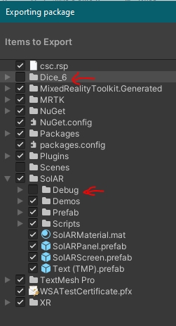

# How to release

## Goal
This document describes the process to follow to make a release for the Hololens 2 Client.

This follows the principles of trunk-based development so the idea is to create release branches from the `develop` branch.

## Set release package name
In the develop branch, the application name has a "Dev" prefix.
This is done so that 2 instances of the application can be installed at the same time on the device:
* a "dev" version used to test the latest features in development
* a "release" version so that we can keep a stable version at all time for demo purposes

When preparing a release, this prefix must be removed to set the definitive name of the application.
To do so:
* `File` > `Build Settings` > `Player Settings`
* Remove the "Dev" prefix from `Product Name` and `PackageName`

When this is done, commit this change in `develop`.

## Create the release branch
While on `develop`:
```bash
$ git checkout -b release/<major.minor.revision>
$ git push -u origin release/<major.minor.revision>
```

## Create the Unity Package
Providing a Unity package allows to import the SolAR Unity client for Hololens 2 in an existing project.
* Open the project in Unity
* `Project` view > right-click on `Assets` > `Export Package...`
* Select the items to export. Deselect debug-related content

* click on `Export...`
* Give it a name with the following pattern: `SolARUnityClientHololens2-x.x.x.unitypackage` (see other release names [here](https://github.com/SolarFramework/SolARUnityClientHololens2/releases)).

## Create a UWP app bundle
Creating a application bundle allows to easily sideload the sample app on a device to test the SolAR services without having to build the Unity project.
* Open the project in Unity
* Either delete existing built artefacts in your build directory or choose a different one for the release, to be sure
* Build the project: `File` > `Build Settings...` > `Build`
* Open the generated Visual Studio project. Since the package name has been changed, a different Visual Studio solution will be generated, so be careful to open the right one to create the bundle
* In the `Solution Explorer` view, right-click on `Publish`
* Select `Sideloading`, use the self signing certificate, check version number, select only `ARM64` architecture, check `include public symbol files` and click on `Create`
* Rename the directory containing all the bundle files as `SolARUnityClientHololens2-sample-x.x.x.zip` (see other release names [here](https://github.com/SolarFramework/SolARUnityClientHololens2/releases))
* Zip the directory with this name.

## Create the GitHub release
* On the [releases page](https://github.com/SolarFramework/SolARUnityClientHololens2/releases), click on `Draft a new release`
* Release title: `v.x.x.x`
* Click on `Choose a tag` and create a new one named `v.x.x.x`
* Click on `Target` and select the release branch (`release/x.x.x`)
* In the description field, add the content of the release notes file for this version
* From an file explorer, drag and drop the unity package and the application bundle files created in the previous steps in the `Attach binaries` section
* Optionnally check `This is a pre-release`
* Cick on `Publish release`

## Restore dev mode and bump version on `develop`
* Go back to develop, `git checkout develop`
* Revert the removal of the "Dev" prefix. If you made a commit doing just that as described before, you can use `git revert <sha-1>` to restore the "Dev" prefix
* Bump version in `File` > `Build Settings...` > `Player Settings`: look for **two** `Version` fields
* Create an new title in `RELEASE-NOTES.md` for the new version
* Commit those changes to `develop`


