# How to use the client for Hololens 2 to access SolAR cloud services

## Create new project

Open Unity Hub and select **New Project**.

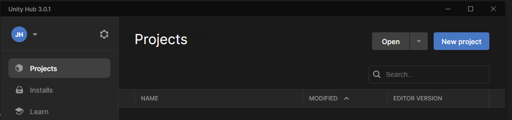

Then select a **3D project** template, and give it a name and a location.

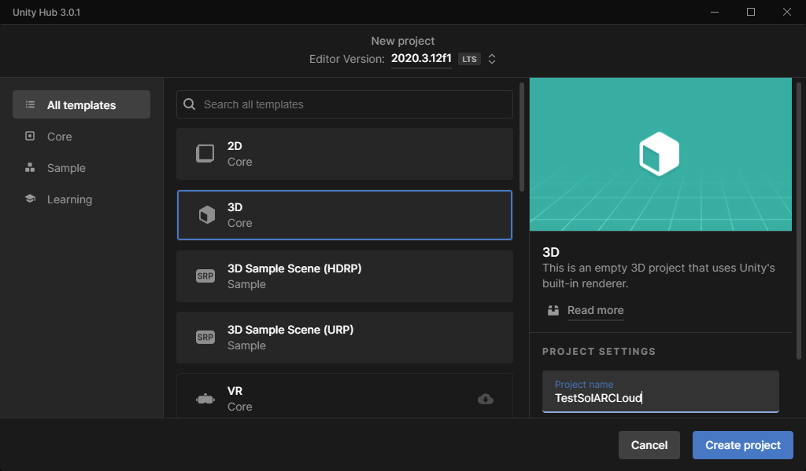

## Import SolAR Unity package

Once your new empty project is open, import the SolAR package which contains the client required
to use SolAR cloud services with a Hololens 2.

Go to **Assets->Import Package...->Custom Package...**

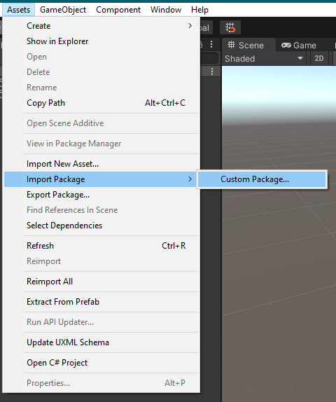

Select the SolAR package, click on **Open**, and you should be presented with the **Import Package** Window.

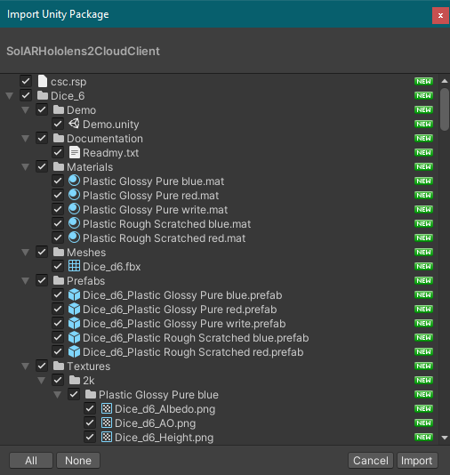

Click on **Select All** if all elements are not selected, and click on **Import**

## The sample scene

The Unity package comes with a simple Unity scene to illustrate how to use the Unity client
for the SolAR cloud services.

### Open the scene

In the **Project** view, navigate to the sample scene and double click to open it.

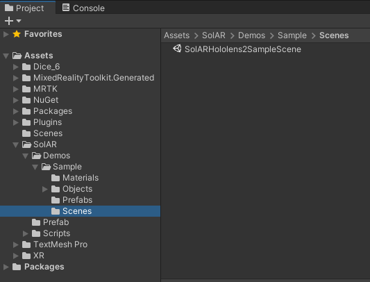

This should look like this:


### Install MRTK components
If you don't see a **Mixed Reality** menu in Unity, you probably need to install MRTK.

To do so, download the [Microsoft Mixed Reality Feature Tool For Unity](https://docs.microsoft.com/en-us/windows/mixed-reality/develop/unity/welcome-to-mr-feature-tool#download).

Click on **start** and point to the Unity project location, and check the following components:

* Mixed Reality Toolkit 
 
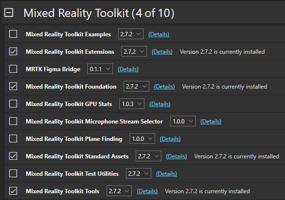

* Platform Support 
 
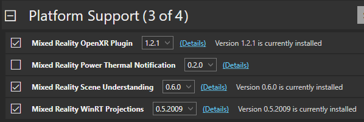

* Other Features 
 
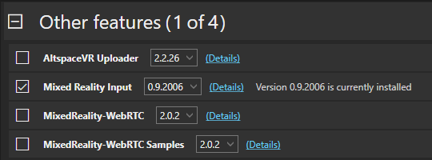

Click on **Import Features**.
 
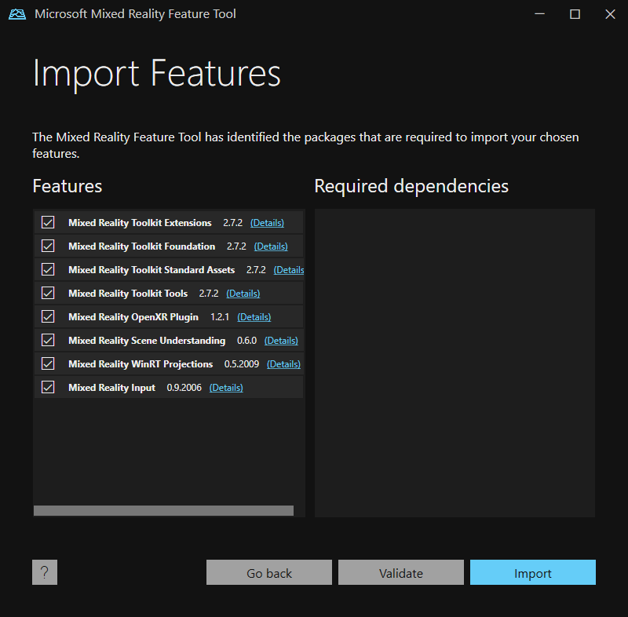

Click on **Approve**.
 
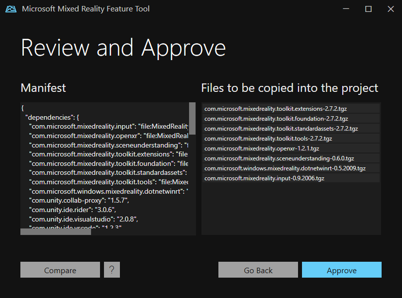

Click on **Exit**.
 
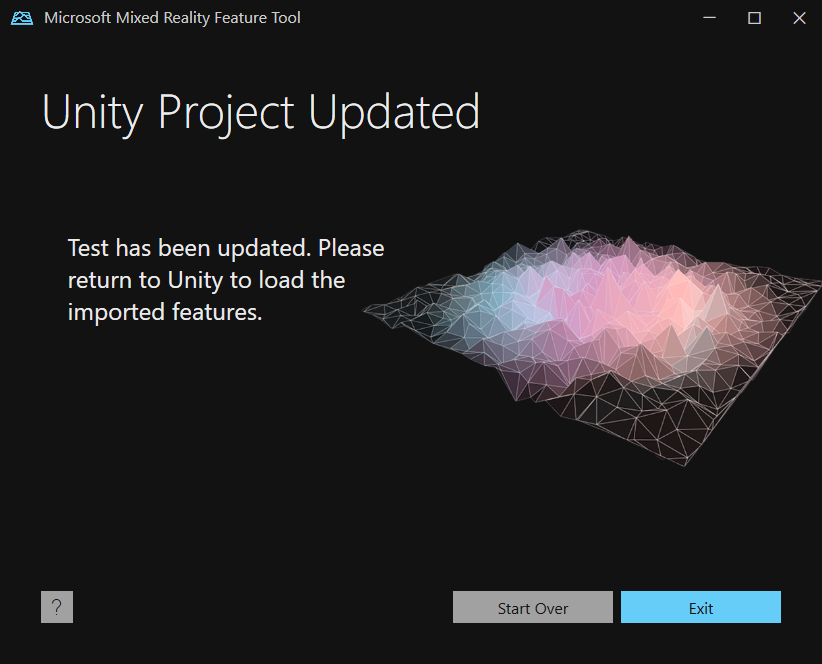

### Configure build settings

In order to build for the Hololens 2, you need to check that build settings are correctly set.

Open the project build settings.

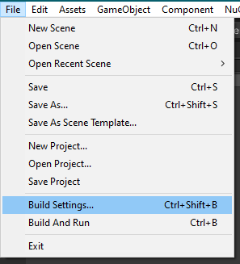

Check that the platform is set to **Universal Windows Platform**. If not, select it and press the **Switch Platform** button.

Check that the build options are set as follows:

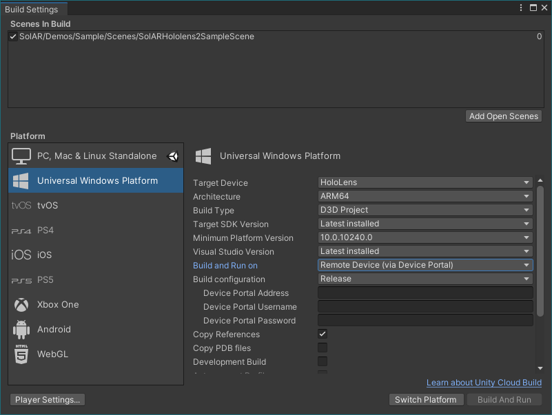

### Build Unity project

Before building, ensure that the current scene is present in the **Scenes In Build** text box. If not, click on the **Add Open Scenes**, and delete other listed scenes.

To build the project, click on the **Build** button. You will be asked to select a destination folder for the generated
UWP Visual Studio solution. Create a dedicated folder, for example named **Build**, so that generated files don't pollute existing non-empty directories of your project.

Navigate to the location you specified previously and open the solution with Visual Studio, if the build stops completed successfully.

### Deploy UWP application on the Hololens 2

The Hololens 2 is assumed to be properly [configured](https://docs.microsoft.com/en-us/windows/mixed-reality/develop/advanced-concepts/research-mode#enabling-research-mode-hololens-first-gen-and-hololens-2), with **Research Mode** enabled.

Once the Visual Studio project generated by Unity is open, verify that the build configuration is as follow:

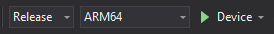

The **Device** option is used to deploy the application when the Hololens 2 is connected via USB to the machine.
You can also deploy it wirelessly by selecting **Remote machine**, but then you need to configure the name/IP of the Hololens 2 in the Debug options, so here we chose to use **Device** for simplicity.

To deploy to the Hololens 2, simply select **Deploy** in the **Build** menu.

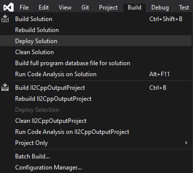

The project will be build and installed.

### Run the sample

Print the 2D marker that will be recognized by the SolAR cloud service as the origin of the world for the scene. For now, it's always the same, but until this can be changed, you can find the marker to print at `Assets/SolAR/Demos/Objects/marker.png`.

Once the sample is running, press on the start button that should be floating before you to initiate the AR session.

After a while, if the marker is within the field of view, an avatar should appear on it.


## Configure the client prefab

### Inspector
Select the prefab in the Hierarchy view, and look at the inspector.

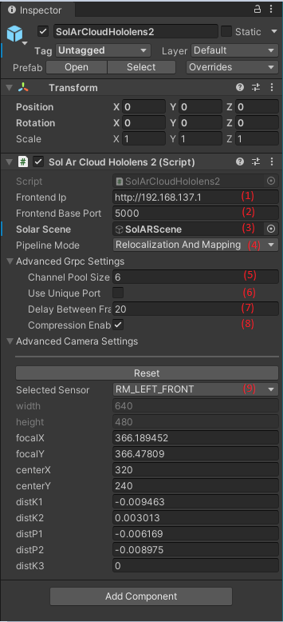

Basic setting:

1. Frontend IP: address of SolAR frontend for cloud services
2. Frontend Base Port: port where the SolAR frontend listens to. If Use Unique Port option is disabled, this is the first port number that will be used, then consecutive numbers will be used for each gRPC channel in the channel pool (i.e. port nummber will be in [\<base port\>..<base port> + \<nb channels\>]). Otherwise, this unique port number will be used for all channels
3. SolAR scene: a Unity GameObject which is the root of the 3D scene which will receive the pose correction from the SolAR cloud relocalization and mapping services. The origin of the scene will be placed at the origin of the SolAR coordinate system.

Advanced settings:

4. Channel Pool Size: amount of reusable gRPC channels in the pool. Each channel will be used to transmit one gRPC call at a time.
5. Use Unique Port: the port specified in Frontend Base Port will be shared among all channels of the pool.
6. Delay between Frames: time to wait between sending of frames.
7. Compression Enabled: toggles compression of sensor images to PNG to save bandwith when sending images to the cloud services.
8. Selected Sensor: pick a sensor camera. Currently only PV (color front facing camera) and LEFT_FRONT (one of the VLC greyscale tracking cameras available in Reasearch Mode) are supported. Default values for intrinsics are editable, allowing a calibration step to refine the values for a particular device. The Reset button can restore default values.

## Control client execution

In order to start and stop the client, register a button `OnClick` event on `SolArCloudHololens2.ToggleSensorCatpure()`.

For example, in the sample scene, an MRTK NearMenu with one button is used.

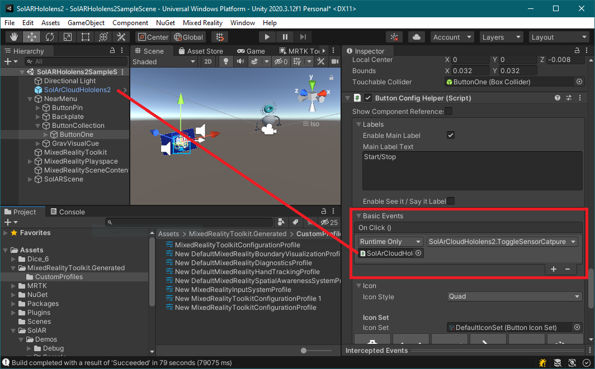

### Scripts

The sample app only does what is previously described. But client also provides some callback methods in order to surface some informations so that it does not completely act as a black box.

These callback falls in 3 categories:

* Hololens 2 sensor data. Any script which subscribed to this event will receive information about the image captured by the native plugin as well as the associated timestamp and pose relative to the Hololens 2 coordinate system origin. 

```csharp
public event Action<...> OnVlcFrame;
public event Action<...> OnPvFrame;
```

* Log messages. These callback received messages from the client, classified in 3 categories: 
    * gRPC for RPC related messages
    * Plugin for native plugin related messages
    * UnityApp for Unity level related messages

```csharp
public event Action<string> OnGrpcError;
public event Action<string> OnPluginError;
public event Action<string> OnUnityAppError;
```

* SolAR pose reception. This callback is called when the SolAR cloud services return a new computation of the pose correction to apply to the Unity scene

```csharp
public event Action<...> OnReceivedPose;
```

In order to connect to these callbacks, you can create a script with a reference to the client, and connect method with the expected signature as follow:

```csharp
public class SolARCloudClientCallbackReceiver : MonoBehaviour
{

    public SolArCloudHololens2 solArCloudHololens2;
[...]
    void Start()
    {
        solArCloudHololens2.OnVlcFrame += OnVlcFrame;
        solArCloudHololens2.OnPvFrame += OnPvFrame;

        solArCloudHololens2.OnGrpcError += OnGrpcError;
        solArCloudHololens2.OnPluginError += OnPluginError;
        solArCloudHololens2.OnUnityAppError +=  OnUnityAppError;
        solArCloudHololens2.OnReceivedPose += OnReceivedPose;
    }
[...]
```


